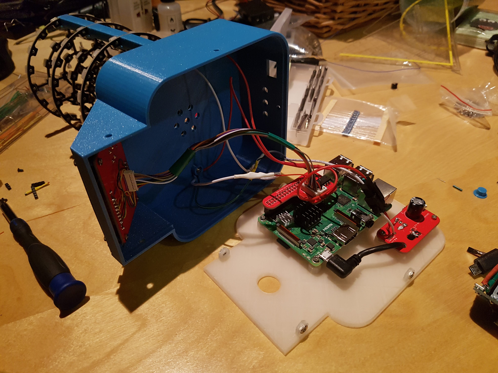

The files in this directory include 3 PCBs:
* One which splits the incoming micro usb power between the RaspberryPi and the LED boards.
Contains a micro usb port, a 1000uf capacitor, a right angle micro usb coord to connect to the Pi, and a connector
(LED strip type) to connect power to the led boards.
* A header board which plugs into the Pi. Contains a 2*20 pin header, a SN74AHCT125N level shifter,
and a 4 pin and 10 pin "JST 1.25mm" connector (that's what they are called on aliexpress at least).
* And a interface board with a standard (6x6mm) push button, a 470 ohm resistor, a 3mm LED,
and the 1.44" tft (with ST7735 driver chip)

The 3 PCBs are combined onto one ~10*10cm panel. Many PCB manufacturers charge extra for panelized designs but
[dirtypcbs](https://dirtypcbs.com) doesn't.

The designs here fix some errors of the ones that I ordered. Assembled mine look like this:

