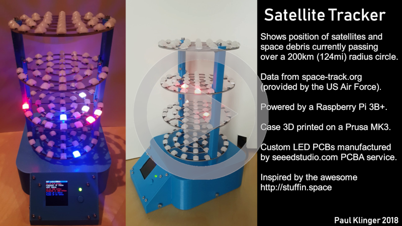
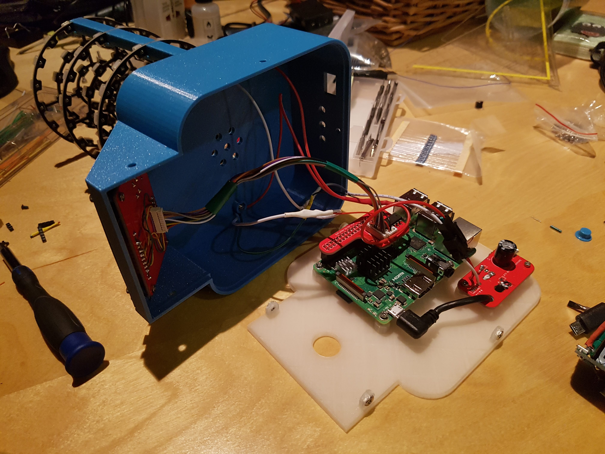

This is the code and hardware design for my
[Satellite tracker](https://www.reddit.com/r/space/comments/9py5qd/i_made_a_thingy_that_shows_satellites_and_space/).

The orbit_np.py file is a modified version of [pyorbital](https://github.com/pytroll/pyorbital)
(it calculates the orbits of all the satellites at the same time to increase performance).

Requires https://github.com/PaulKlinger/LIBtft144 and https://github.com/jgarff/rpi_ws281x + a bunch of libraries from PyPi.

The PCB design for the LED boards is in the PCBs/LED folder. I've reversed the VCC/GND connections on one side of the pcb
compared to my version to make assembly easier. Files for three additional PCBs connecting the various parts are in the
PCB/auxiliary folder (these are not strictly necessary, I just used protoboard for the first version).

The STLs and Fusion 360 source for the 3d printed parts are in the "3D printed parts" folder.
Note that the 3d printer files are for a slightly earlier version of the auxiliary PCBs, which still had some issues.
So the current ones probably don't fit exactly, e.g. the display cutout might be slightly offset.

I'd strongly recommend that anyone who builds this uses threaded rods through the pillars instead of the million screws
I used. (I just didn't have any rods and wanted to build it right away.)

The 3 PCBs in the PCBs/auxiliary folder include:
* One which splits the incoming micro usb power between the RaspberryPi and the LED boards.
Contains a micro usb port, a 1000uf capacitor, a right angle micro usb coord to connect to the Pi, and a connector
(LED strip type) to connect power to the led boards.
* A header board which plugs into the Pi. Contains a 2*20 pin header, a SN74AHCT125N level shifter,
and a 4 pin and 10 pin "JST 1.25mm" connector (that's what they are called on aliexpress at least).
* And an interface board with a standard (6x6mm) push button, a 470 ohm resistor, a 3mm LED,
and the 1.44" tft (with ST7735 driver chip)

These 3 PCBs are combined onto one ~10*10cm panel. Many PCB manufacturers charge extra for panelized designs but
[dirtypcbs](https://dirtypcbs.com) doesn't.

The designs here fix some errors of the ones that I ordered. Assembled mine look like this:

